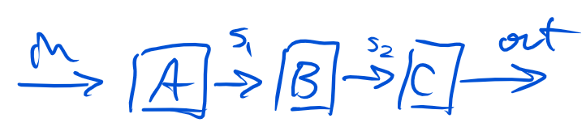
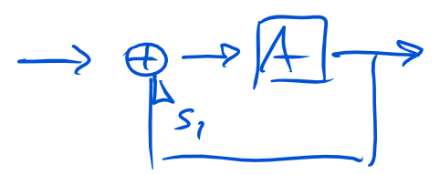
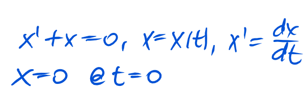
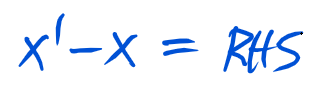
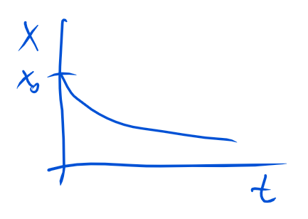
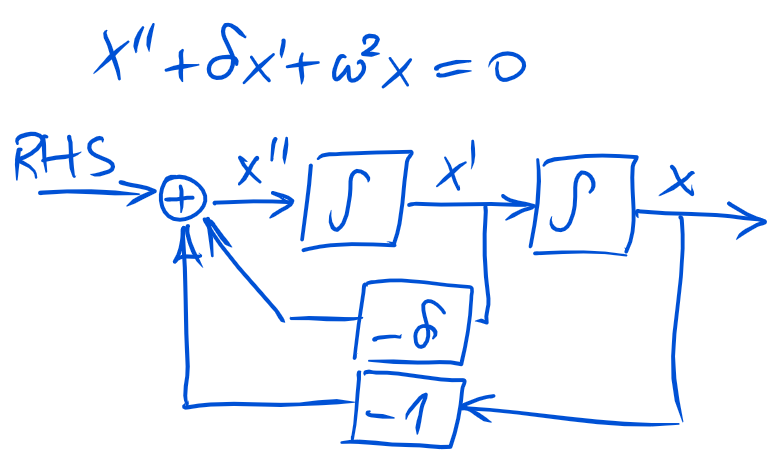
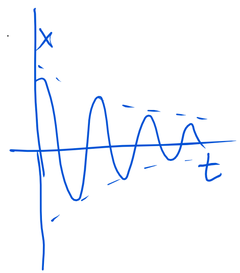

# loops
demonstration of Go concepts to solve Simulink style block computations

This is a demonstration of some concepts of the [go programming language](http://www.golang.org) which make it very simple to build a [Simulink](www.mathworks.com/products/simulink)-like system, which can solve differential equations.

It demonstrates:
- interfaces
- channels
- goroutines

# Introduction to block diagrams and differential equations
## Closed loop pipes
Similar to a traditional UNIX pipe, we consider the system


as a sequence of individual blocks, each having an input and an output channel.
All data is processed instantly and simultaneously on all blocks.

For long time, I wondered if a UNIX pipe could be used, to build so-called closed-feedback loops, as the occur in control theory.


A closed loop takes the output of a block and feeds it back somewhere before.
This has the further implication, that an initial condition (here for s1) must be thought of.
To my knowledge, this is not possible with a traditional UNIX pipe, at least not easily.

However, this it turns out to be quite simple with go.

## Differential equations
With the system we can solve ordinary differential equation, such as the simple example


It is a linear equation of the variable x which evolves with time t.
On the right hand side (RHS) may be any function of t, in this case it is 0 for all times, except the initial condition where it is x0.
More generally we may write it as



In the block diagram, we interprete everthing on the RHS as the system input and the evolving state of x as the system output.


If we plot the output x over time we get an exponential decay



## 2nd order example
The next example is slightly more interesting. It is a 2nd order equation and has the potential to generate an osillating solution which may grow or decay over time depending on the sign of the factor delta.





# Implementation
## Blocks
A block is implemented as an [interface](https://golang.org/doc/effective_go.html#interfaces).
```go
type Block interface {
	Step([]float64, []float64)
	Inputs() int
	Outputs() int
}
```
It must provide 3 methods:
- Inputs: returns the number of input channels
- Outputs: returns the number of output channels
- Step: computes the output signals from the input signals for one time step.
This is all a block must do.

A block may have 0 inputs, than it is a signal generator, or 0 ouputs than it is a consumer, e.q. a function which logs or plots the data it receives.

An example block is the `Scale` type, which multiplies the input with a constant factor
```go
type Scale float64

func (b Scale) Inputs() int  { return 1 }
func (b Scale) Outputs() int { return 1 }
func (b Scale) Step(in, out []float64) {
	out[0] = float64(b) * in[0]
}
```

Another example is the `Integrate` block which has been used in the examples.
In it's simples form, it is multiplies the input with the differential time step:
```go
type Integrate struct {
	State float64 // This can be set as the initial state.
}

func (b *Integrate) Inputs() int  { return 1 }
func (b *Integrate) Outputs() int { return 1 }
func (b *Integrate) Step(in, out []float64) {
	b.State += in[0] * DT
	out[0] = b.State
}
```
It needs to keep track of it's state as it has to remember what happened in the past: The integral sum is stored in the struct field State.
The time step `DT` is defined elsewhere as a global variable.

Any type of blocks may be invented in the future. They may be implemented outside this package and can still be used. All they have to do is implement the interface.

## System
Blocks are connected to form a `system`.
The system itself is implemented to satisfy the block interface.
This way, it can be used as a subsystem. Any level of nesting is possible.

```go
type System struct {
	In, Out     []chan float64
	blocks      []ioBlock
	initialized bool
}

func (s *System) Inputs() int  { return len(s.in) }
func (s *System) Outputs() int { return len(s.out) }
func (s *System) Step(in, out []chan float64) {
	// This is needed to start sub-systems only.
	// The outer system is started manually.
	if !initialized {
		s.Start()
	}
}
```

To buid a new system, all blocks need to be declared, e.g.
```go
var add1, add2 Add
integ1 := Integrate{0.12}
...
```

The system stores all block which belong to it as well as the connections between them.
For the connections [go channels](https://golang.org/doc/effective_go.html#channels) are used.

The connect method can be used to set them up.
```go
func (s *System) Connect(src, dst int, i, o int)
```

Finally the outer-most system is started with it's `Start` method.
It creates one [goroutine](https://golang.org/doc/effective_go.html#goroutines) per block and lets the run in parallel.
Inside the goroutine, the channel data is read and passed to the block's step function.
The result is then fed back to the output channels.
```go
func (s *System) Start() error {
	// Check if all system blocks are properly connected.
	if err := s.check(); err != nil {
		return err
	}

	// Create a goroutine for every block.
	// The goroutine runs in the background.
	// It's a function that loops for ever
	// and calls the block's Step function each time.
	for i, b := range s.blocks() {
		// Arrange input and output channels
		// for the block's step function.
		go func(in, out []chan float64, b Block) {
			x := make([]float64, len(in))
			y := make([]float64, len(out))
			for {
				var ok bool
				for i, c := range in {
					x[i], ok = <-c
					if !ok {
						return
					}
				}
				b.Step(x, y)
				for i, c := range out {
					c <- y[i]
				}
			}
		}(s.in[i], s.out[i], b)
	}
	return nil
}
```

This is all there is to do make concurrency with goroutines work.

# TODO
- a more interesting example of a nonlinear equation, such as a strange attractor.
