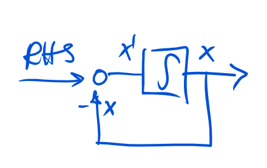

# loops
demonstration of Go concepts to solve Simulink style block computations

This is a demonstration of some concepts of the [go programming language](http://www.golang.org) which make it very simple to build a [Simulink](www.mathworks.com/products/simulink)-like system, which can solve differential equations.

It demonstrates:
- concurrency: goroutines and go channels
- interfaces

# Introduction to block diagrams and differential equations
## Closed loop pipes
Similar to a traditional UNIX pipe, we consider the system

as a sequence of individual blocks, each having an input and an output channel.
All data is processed instantly and simultaneously on all blocks.

For long time, I wondered if a UNIX pipe could be used, to build so-called closed-feedback loops, as the occur in control theory.

A closed loop takes the output of a block and feeds it back somewhere before.
This has the further implication, that an initial condition (here for s1) must be thought of.
To my knowledge, this is not possible with a traditional UNIX pipe, at least not easily.

However, this it turns out to be quite simple in go.

## Differential equations
With the system we can solve ordinary differential equation, such as the simple example

It is a linear equation of the variable x which evolves with time t.
On the right hand side (RHS) may be any function of t, in this case it is 0 for all times, except the initial condition where it is x0.
More generally we may write it as

In the block diagram, we interprete everthing on the RHS as the system input and the evolving state of x as the system output.

If we plot the output x over time we get an exponential decay

## 2nd order example
The next example is slightly more interesting. It is a 2nd order equation and has the potential to generate an osillating solution which may grow or decay over time depending on the sign of the factor delta.

# Implementation

